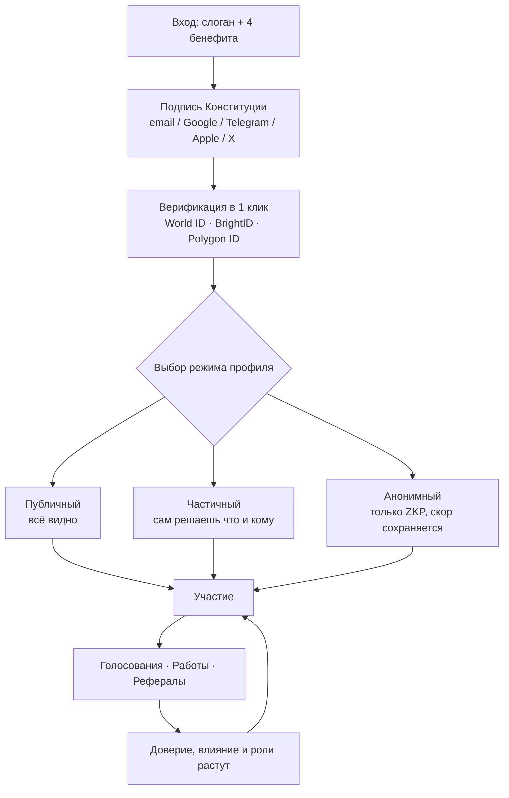
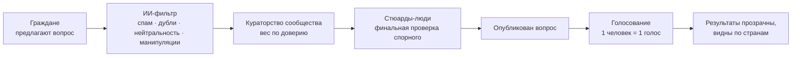
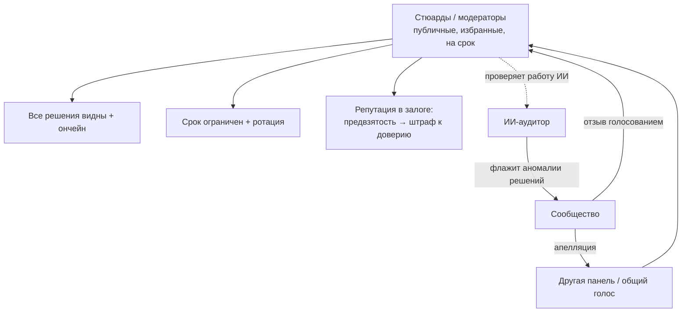

# Визуальные схемы

> Диаграммы в формате Mermaid — рендерятся как картинки прямо на GitHub.
> Описание словами — в [USER_FLOW.md](./USER_FLOW.md) и [ACTIVITY.md](./ACTIVITY.md).

---

## 1. Путь пользователя

**Главное:** базовое участие (подпись, голос) — одинаково для всех трёх режимов. Различие — только в премии за открытость.

---

## 2. Как рождается голосование (конвейер)

**Главное:** ИИ работает на потоке (масштаб), человек решает спорное (суждение). Ни ИИ, ни человек не делают этого в одиночку.

---

## 3. Кто модерирует модераторов (взаимный контроль)

**Главное:** человек проверяет ИИ, ИИ проверяет человека. Оба прозрачны, сменяемы и отвечают репутацией. Финальной несменяемой власти нет ни у кого (Статья 4).
